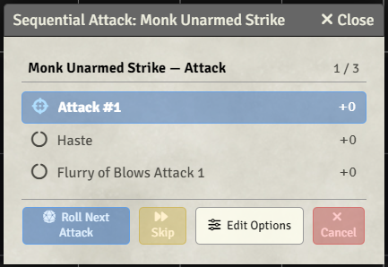

# PF1 Sequential Attacks 

A Foundry VTT module that allows full attacks to be resolved one attack at a time instead of all at once.

**Version:** 1.1.0  
**Foundry VTT Compatibility:** v13  
**Manifest URL:** `https://github.com/Hamilcarbarcas/pf1-sequential-attacks/releases/latest/download/module.json`

## Features



- **Sequential Attack Resolution**: Roll each attack in a full attack sequence individually
- **Visual Tracker**: Dialog displays all attacks in the sequence with status indicators:
  - Current attack
  - Completed attacks
  - Skipped attacks
  - Pending attacks
- **Per-Attack Control**: 
  - Roll attacks one at a time using the "Roll Next Attack" button
  - Skip individual attacks without rolling them
  - Retarget between attacks
  - Toggle buffs/debuffs between attacks
- **Roll All Remaining**: Roll every remaining (unresolved) attack at once in a single chat card — the same as the system's default full-attack behaviour — to quickly finish out a sequence you no longer need per-attack control over
- **Attack Bonus Preview**: See the calculated attack bonus for each attack before rolling
- **Progress Tracking**: Dialog shows current attack count
- **Individual Chat Cards**: Each attack posts its own chat message when resolved
- **Theming**: The tracker uses an amber-on-dark theme by default; a per-client **Use Legacy Theme** setting restores the original blue/green/gold colour scheme

## Usage

### Enabling Sequential Attacks
Sequential mode is **on by default**. Each player's choice is saved per user, so it follows them to any browser. To turn it off:
1. Open the module settings
2. Find "Sequential Full Attacks" setting
3. Toggle it off

### Appearance
The tracker window ships with two colour schemes, chosen per client under **Use Legacy Theme**:

- **Off (default)** — amber accent on dark panels, matching this author's other PF1 modules.
- **On** — the module's original scheme: blue current attack, green resolved, gold skipped, tinted buttons.

This setting affects appearance only. Note that the default theme states its own colours rather than following Foundry's light/dark theme, so it stays dark regardless of your client theme.

### During an Attack
When you have multiple attacks in a full attack sequence and sequential mode is enabled:
1. The attack dialog appears as normal
2. After confirming the dialog, a sequential tracker shows all your attacks
3. Click **"Roll Next Attack"** to roll the current attack and post it to chat
4. **"Skip"** an attack if you don't want to roll it
5. **"Roll All Remaining (N) as one card"** to roll every remaining attack together in a single chat card (vanilla full-attack behaviour); shown whenever two or more attacks are left. Note: this snapshots actor state once, so buffs toggled *between* the batched attacks are not applied individually.
6. **"Cancel"** to abort the entire sequence

The tracker will auto-close when all attacks are resolved.

### Per-attack scripts and animations

Install **pf1-new-script-hooks** (v1.6.0 or later) and its **Per Use** script call category fires
once for each attack in the sequence, as that attack's card is built. `shared.targets` has already
been refreshed by then, so it holds the target *that* attack is aimed at — which is what a
per-projectile Sequencer/JB2A effect needs:

```js
// Per Use script call on the action
new Sequence()
  .effect()
    .file("jb2a.chain_lightning.primary.blue")
    .atLocation(token)
    .stretchTo(shared.targets[0])
  .play();
```

The same script also works with sequential mode off — the category fires once per row of the
single card instead — so nothing has to know which mode is in use. Without that module installed,
nothing happens and no script runs.

### Actions that roll no attack

Normally these have nothing to sequence: one use, one card, and the module hands straight off to
the usual flow. If another module gives such an action more than one entry — repeated uses of a
multi-projectile spell like magic missile, which rolls no attack — the tracker walks those uses
one at a time just as it does a full attack, so you can retarget between them. No attack roll is
made for them, and the bonus column stays blank.

### For module developers

In sequential mode, `pf1PostActionUse` fires only once, when the tracker closes. It passes the
**last** card, and by then `shared.attacks` is the whole sequence again. Code that needs every
card should also listen to this hook:

```js
Hooks.on("pf1SequentialAttacks.postCard", (actionUse, message) => { /* ... */ });
```

It fires after each card posts, whether the card holds one attack or a Roll All Remaining batch.
While it runs, `shared.attacks` holds just that card's attacks, in the card's order, so index `i`
is row `i` of the card's `system.rolls.attacks`. `message` is `null` if the card was hidden. To
avoid handling the same attacks twice, skip the final `pf1PostActionUse` when
`shared.sequentialAttack` is set.

## Compatibility

- **Minimum Foundry Version**: 13
- **Verified Version**: 13
- **Required Dependencies**:
  - **libWrapper** (https://github.com/ruipin/fvtt-lib-wrapper)
  - **Pathfinder 1e** system
- **Optional**:
  - **pf1-new-script-hooks** v1.6.0+ — enables the per-attack **Per Use** script call category described above.
